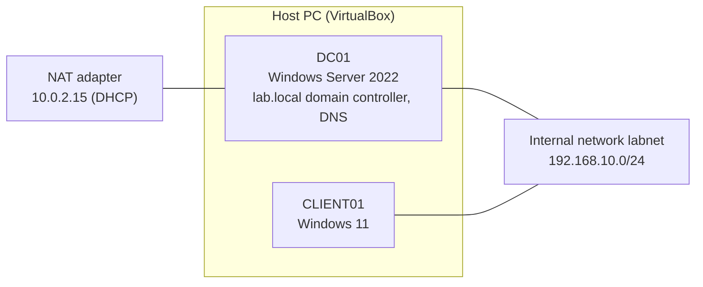

# 00 - Lab Overview

## Purpose
A Windows Server and Active Directory home lab built on VirtualBox to
practice domain administration, documented step by step.

## Topology


## Machines
| Name | OS | Role | Address (labnet) |
|---|---|---|---|
| DC01 | Windows Server 2022 | Domain controller, DNS | 192.168.10.10 |
| CLIENT01 | Windows 11 | Domain-joined client | 192.168.10.20 |

## Domain structure
```
lab.local
└── Company
    ├── Users        (it.user, acc.user)
    ├── Computers
    └── Groups       (IT-Staff, Accounting-Staff)
```

## Documentation
1. [VM and network setup](01-vm-network-setup.md)
2. [Active Directory setup](02-active-directory-setup.md)
3. [OUs, users and groups](03-ou-users-groups.md)
4. [Client domain join](04-client-domain-join.md)

## Planned (not yet implemented)
- File server with group-based permissions
- Group Policy
- DHCP server role
- PowerShell administration basics
